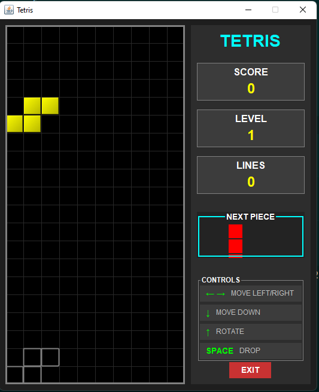

# 🎮 Tetris Java Desktop


<hr>

Una recreación clásica del juego Tetris desarrollada en Java para escritorio. Este proyecto fue creado para practicar lógica de programación, manejo de gráficos 2D y Programación Orientada a Objetos (POO).

<hr>

## 📸 Capturas de Pantalla


<hr>

## ✨ Características

* 🧩 **Mecánicas Clásicas:** Rotación de piezas, eliminación de líneas y caída acelerada.
* 📊 **Sistema de Puntuación:** El puntaje aumenta al completar líneas.
* 👀 **Siguiente Pieza:** Previsualización de la figura que caerá a continuación.
* gameover **Game Over:** Detección de colisiones y fin del juego.

<hr>

## 🛠️ Tecnologías Utilizadas

* **Lenguaje:** Java (JDK [versión 17])
* **Biblioteca Gráfica:** [Swing / AWT / JavaFX]
* **IDE Recomendado:** IntelliJ IDEA / Eclipse / NetBeans

<hr>

## 🚀 Instalación y Ejecución

Sigue estos pasos para probar el juego en tu máquina local:

### Prerrequisitos
Asegúrate de tener instalado Java:
```bash
java -version
```

### Pasos
* Clonar el repositorio:
```bash
git clone https://github.com/miguel-124C/TetrisJavaDesktop.git
```
* Navegar a la carpeta
```bash
cd TetrisJavaDesktop
```
* Compilar y Ejecutar si usas terminal:
```bash
javac src/Main.java
java src/Main
```
O simplemente abre el proyecto en tu IDE favorito y ejecuta la clase `Main`.

<hr>

## 🎮 Controles Tecla Acción
* `🡅` Rotar Pieza
* `←` Mover Izquierda
* `🡆` Mover Derecha
* `🡇` Acelerar caída (Soft Drop)
* `Espacio` Caída instantánea (Hard Drop)

## 👤 Autor
* [GithubProfile](https://github.com/miguel-124C)
* [LinkedIn](www.linkedin.com/in/miguel-cuellar-013a96258)